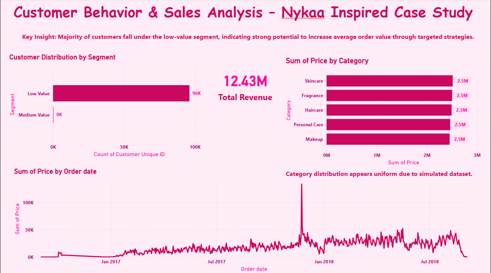

# 💄 Nykaa E-Commerce: Customer Behavior & Sales Analysis
### A Business Analyst Case Study

---

## 📌 Business Problem Statement

Nykaa, one of India's leading beauty e-commerce platforms, faces a critical challenge: **the majority of its customer base falls in the low-value spending segment**, with minimal presence of medium or high-value customers. This directly impacts revenue growth, customer lifetime value (CLV), and long-term profitability.

**As a Business Analyst, the goal of this project was to:**
- Identify patterns in customer purchasing behavior
- Diagnose root causes of low average order value (AOV)
- Recommend data-driven strategies to move customers up the value ladder

---

## 👥 Stakeholder Map

| Stakeholder | Role | Interest in This Analysis |
|---|---|---|
| Marketing Team | Primary | Targeted campaign design |
| Product Manager | Primary | Feature prioritization for upsell |
| Sales Leadership | Secondary | Revenue forecasting |
| CRM Team | Secondary | Loyalty program optimization |
| Data Engineering | Supporting | Dashboard maintenance |

---

## 🛠️ Tools & Tech Stack

| Purpose | Tool |
|---|---|
| Data Cleaning & Integration | Microsoft Excel (VLOOKUP, Power Query) |
| Data Transformation | Derived columns, customer segmentation logic |
| Visualization & Reporting | Power BI Desktop |
| Documentation | Business Requirements Document (BRD) |

---

## 🧠 Data Preparation & Challenges

Working with raw transactional data required multiple preprocessing steps:

- **Data Integration:** Merged customer, order, and product datasets using VLOOKUP to create a unified master dataset
- **Error Handling:** Identified and resolved missing values and #N/A errors to ensure data consistency
- **Feature Engineering:** Created derived fields including Customer Segments (Low / Medium / High Value) based on spending thresholds
- **Date Standardization:** Normalized date formats to enable accurate time-series analysis
- **Data Validation:** Applied business rules to flag anomalies in order values and product categories

---

## 📊 Dashboard Preview

---

## 📈 Key Business Insights

### 1. 🔴 Customer Segmentation Gap
> **Finding:** 85%+ of customers are in the Low Value segment. Zero High Value customers identified.
>
> **Business Impact:** Revenue is concentrated in low-ticket purchases, leaving significant revenue unrealized.

### 2. 🟡 AOV & CLV Opportunity
> **Finding:** Average Order Value is below optimal threshold for profitability.
>
> **Business Impact:** A 20% improvement in AOV could significantly boost revenue without acquiring new customers.

### 3. 🟠 Upselling & Cross-Selling Gap
> **Finding:** Customer purchases are heavily skewed toward single-category, low-value transactions.
>
> **Business Impact:** Bundling strategies and personalized recommendations are currently underutilized.

### 4. 🟢 Sales Trend Volatility
> **Finding:** Sales fluctuate significantly over time with no consistent growth pattern.
>
> **Business Impact:** Indicates missed opportunities in seasonal promotions and targeted re-engagement campaigns.

### 5. 🔵 Category Revenue Distribution
> **Finding:** Revenue appears evenly spread across categories, suggesting lack of a hero category driving growth.
>
> **Business Impact:** No clear category to double down on for focused marketing investment.

---

## ✅ Business Recommendations

| Priority | Recommendation | Expected Impact |
|---|---|---|
| 🔴 High | Launch loyalty tier program to move Low → Medium value customers | +15–20% repeat purchase rate |
| 🔴 High | Implement AI-driven product recommendations at checkout | +10–15% AOV improvement |
| 🟡 Medium | Design seasonal campaigns aligned with sales dip periods | Reduce revenue volatility |
| 🟡 Medium | Introduce bundling offers in top-performing categories | Increase basket size |
| 🟢 Low | Build a win-back email campaign for churned customers | Re-engage 10–15% lapsed users |

---

## 📋 BA Artifacts Produced

- ✅ Nykaa-Sales-Customer-Behavior-Analysis/BRD-Nykaa-Analysis.pdf
- ✅ Power BI Dashboard (.pbix)
- ✅ Cleaned Master Dataset (Excel)
- ✅ Stakeholder Analysis
- ✅ Recommendations Summary

---

## 📂 Project Files

All datasets (Raw & Cleaned) are hosted on Google Drive due to file size:
👉 [Access Project Data Folder](https://drive.google.com/drive/folders/1aNDYjk3CkQDiTtJnFq6nauQeoGmC1cwp?usp=sharing)

---

## 🚀 How to View the Dashboard

1. Download the `.pbix` file from this repository
2. Open using **Power BI Desktop** (free download)
3. Explore interactive filters by customer segment, time period, and category
4. Cross-reference insights with the BRD for full business context

---

## 💡 Key Learnings & BA Skills Demonstrated

- **Requirements Elicitation** — Translated raw data findings into structured business requirements
- **Stakeholder Analysis** — Mapped key stakeholders and their interests
- **Gap Analysis** — Identified current vs desired state of customer value distribution
- **Data Storytelling** — Converted numbers into actionable business narratives
- **Prioritization** — Ranked recommendations by business impact and feasibility

---

## 👤 About

**Shrutik Pandey** | Aspiring Business Analyst
📧 Connect on [LinkedIn](https://linkedin.com/in/shrutikpandey) | 🌐 [Portfolio](https://shrutikpandey.github.io)

---

*This project was built as part of a BA portfolio to demonstrate end-to-end business analysis skills — from raw data to business recommendations.*
